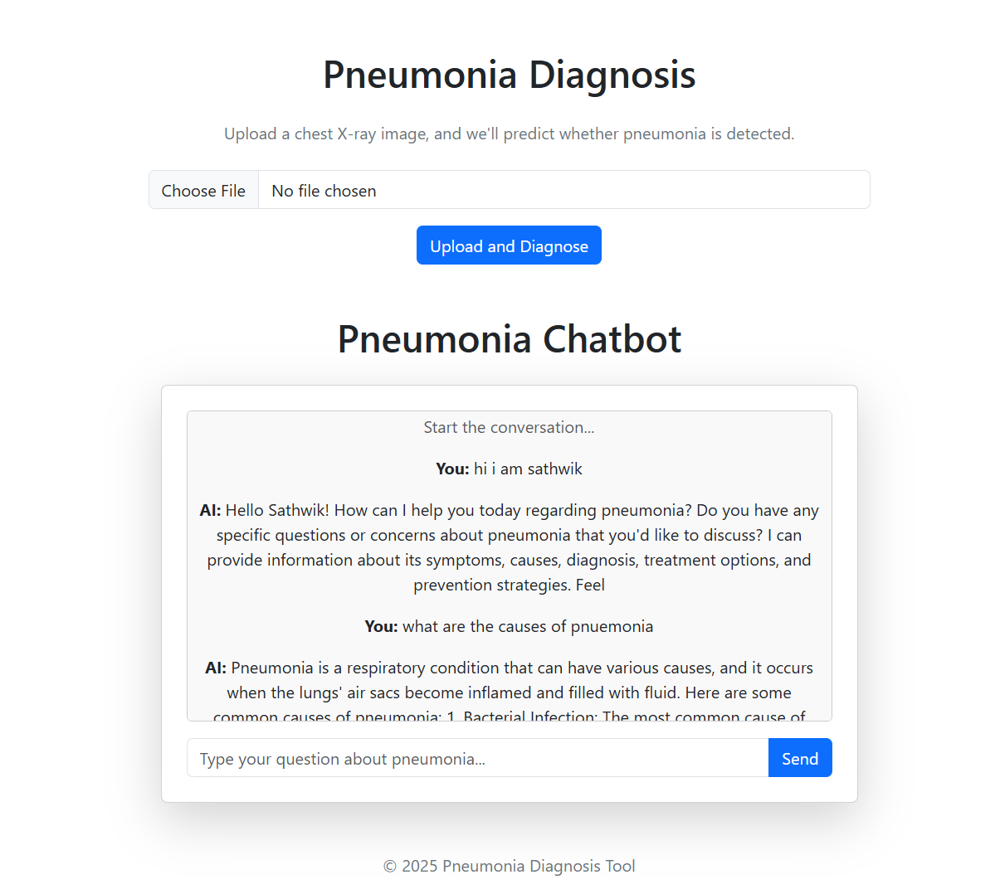
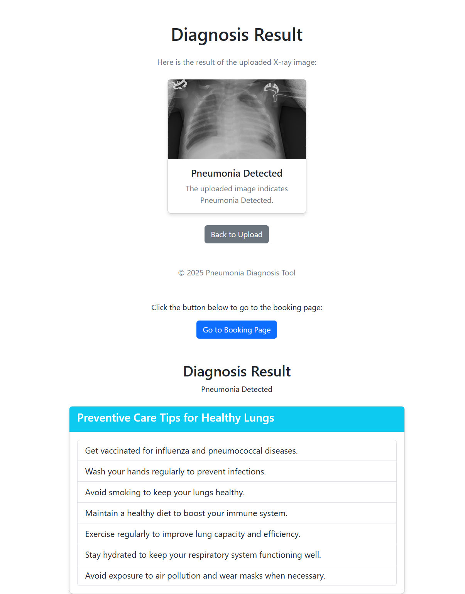

<<<<<<< HEAD
# AI-Powered Pneumonia Detection 

## Overview
This project creates a web-based AI-powered pneumonia detection system using Flask. Users can upload chest X-ray images, get predictions (Normal or Pneumonia.
---






---

## Features
1. Upload chest X-ray images for pneumonia detection.
2. AI model predicts whether the image indicates "Normal" or "Pneumonia".
3. AI chatbot which assist with the user queries.
4. A booking portal.

---


## Steps

### 1. Set up the Environment
1. Install Python.
2. Create a virtual environment and activate it:
   ```bash
   python -m venv venv
   source venv/bin/activate  # On Windows: venv\Scripts\activate
   ```
3. Install required libraries:
   ```bash
   pip install Flask tensorflow Pillow  pandas
   ```

### 2. Collect and Preprocess the Dataset
1. Download a pneumonia dataset (e.g., from Kaggle's Chest X-ray Dataset).
2. Preprocess images (resize, normalize, augment).
3. Split data into training, validation, and test sets.

### 3. Train the Initial AI Model
1. Train a Convolutional Neural Network (CNN) for pneumonia detection.
2. Save the model as `pneumonia_model.h5`.

### 4. Set up the Flask Project
1. Create the folder structure as shown above.
2. Add Flask routes for:
   - **Home Page (`/`)**: Upload form.
   - **Prediction (`/predict`)**: Process the image and display the result.


### 5. Write the Flask Backend
1. Load the trained model using `tensorflow.keras.models.load_model()`.
2. Define routes for uploading images, predicting, and storing feedback.
3. Preprocess uploaded images (resize, normalize) before prediction.
4. Save feedback and images to the database.

### 6. Create HTML Templates
1. **index.html**: Contains an image upload form and a submit button.
2. **result.html**: Displays the prediction and a feedback form.

### 7. Test the Application Locally
1. Run the Flask app using:
   ```bash
   python app.py
   ```
2. Upload sample images to test predictions.
3. Submit feedback and verify that it is saved in the database.


---

## Dependencies
- Python 3.x
- Flask
- TensorFlow
- Pillow
- pandas

---

## Usage
1. Clone the repository:
   ```bash
   git clone <repository_url>
   cd project
   ```
2. Install dependencies:
   ```bash
   pip install -r requirements.txt
   ```
3. Run the application:
   ```bash
   python app.py
   ```
4. Access the application at `http://127.0.0.1:5000/`.

---

## Future Enhancements
1. Add a user authentication system.
2. Implement advanced feedback validation mechanisms.
3. Optimize the model for faster inference.
4. Provide detailed visualizations of predictions (e.g., heatmaps for pneumonia regions).
=======
# AI-Powered Pneumonia Detection 

## Overview
This project creates a web-based AI-powered pneumonia detection system using Flask. Users can upload chest X-ray images, get predictions (Normal or Pneumonia.
---


---

## Features
1. Upload chest X-ray images for pneumonia detection.
2. AI model predicts whether the image indicates "Normal" or "Pneumonia".
3. AI chatbot which assist with the user queries.
4. A booking portal.

---


## Steps

### 1. Set up the Environment
1. Install Python.
2. Create a virtual environment and activate it:
   ```bash
   python -m venv venv
   source venv/bin/activate  # On Windows: venv\Scripts\activate
   ```
3. Install required libraries:
   ```bash
   pip install Flask tensorflow Pillow  pandas
   ```

### 2. Collect and Preprocess the Dataset
1. Download a pneumonia dataset (e.g., from Kaggle's Chest X-ray Dataset).
2. Preprocess images (resize, normalize, augment).
3. Split data into training, validation, and test sets.

### 3. Train the Initial AI Model
1. Train a Convolutional Neural Network (CNN) for pneumonia detection.
2. Save the model as `pneumonia_model.h5`.

### 4. Set up the Flask Project
1. Create the folder structure as shown above.
2. Add Flask routes for:
   - **Home Page (`/`)**: Upload form.
   - **Prediction (`/predict`)**: Process the image and display the result.


### 5. Write the Flask Backend
1. Load the trained model using `tensorflow.keras.models.load_model()`.
2. Define routes for uploading images, predicting, and storing feedback.
3. Preprocess uploaded images (resize, normalize) before prediction.
4. Save feedback and images to the database.

### 6. Create HTML Templates
1. **index.html**: Contains an image upload form and a submit button.
2. **result.html**: Displays the prediction and a feedback form.

### 7. Test the Application Locally
1. Run the Flask app using:
   ```bash
   python app.py
   ```
2. Upload sample images to test predictions.
3. Submit feedback and verify that it is saved in the database.


---

## Dependencies
- Python 3.x
- Flask
- TensorFlow
- Pillow
- pandas

---

## Usage
1. Clone the repository:
   ```bash
   git clone <repository_url>
   cd project
   ```
2. Install dependencies:
   ```bash
   pip install -r requirements.txt
   ```
3. Run the application:
   ```bash
   python app.py
   ```
4. Access the application at `http://127.0.0.1:5000/`.

---

## Future Enhancements
1. Add a user authentication system.
2. Implement advanced feedback validation mechanisms.
3. Optimize the model for faster inference.
4. Provide detailed visualizations of predictions (e.g., heatmaps for pneumonia regions).
>>>>>>> 1f86cd2daff1e128d88bc76a9e60c213cb10331e
5. Will predict other lung related diseases (e.g Covid-19, tuberculosis...)